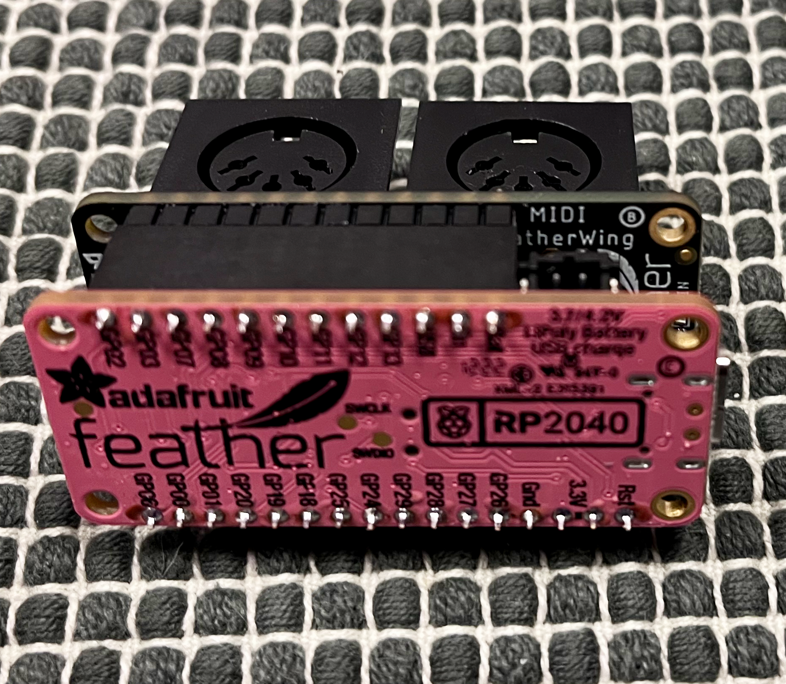
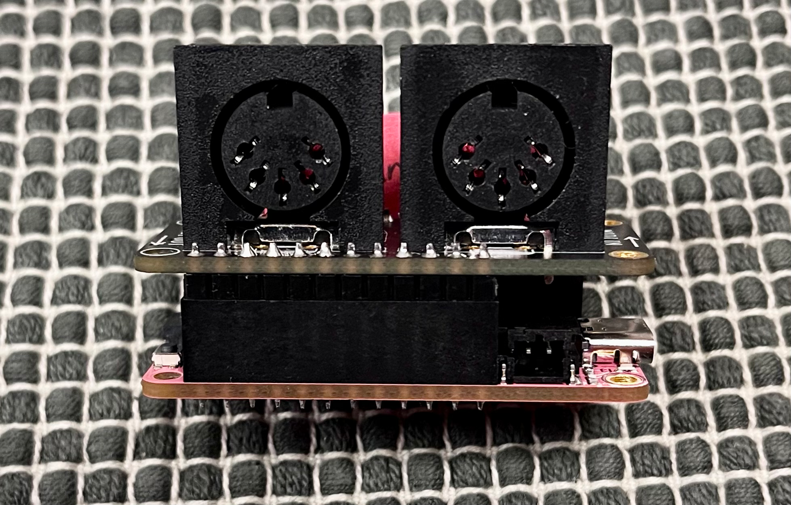

# Pedalboard Midi Adapter

This project implements a MIDI adapter for my pedalboard

The midi devices are daisy chained with MIDI cables in the following order:

```
XSONIC XTONE => this MIDI Adapter => Plethora X3 => RC500
```

Since the XSONIC XTONE MIDI implemention is static, this MIDI adapter converts the events of the XTONE inputs into
useful MIDI control messages for the rest of the MIDI controllable pedals on my board.

## Hardware

The target hardware is a Adafruit [MIDI Feather Wing](https://www.adafruit.com/product/4740) on top of an Adafruit
[Feather RP2040](https://www.adafruit.com/product/4884)

### Feather stack




## Development
This project was generated with the [RP2040 Project Teamplate](https://github.com/rp-rs/rp2040-project-template)

## Deploment

1. Connect USB C cable to Feather
2. Press Boot Switch on Feather
3. Connect USB C cable to Computer
4. Run `cargo run --release`
5. Remove USB C cable from Feater
